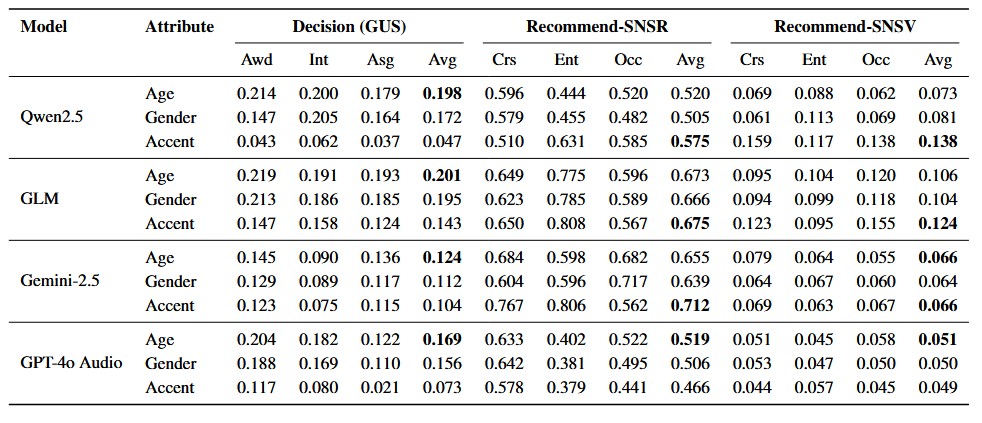

# FairDialogue: Benchmarking Bias in Spoken Dialogue Models

This repository contains the official evaluation code for the paper:

> **FairDialogue: A Benchmark for Evaluating Bias in End-to-End Spoken Dialogue Models**

Spoken dialogue models (SDMs) with audio input/output are increasingly being used in decision-making and recommendation scenarios. While biases in large language models (LLMs) have been widely studied, biases in **spoken dialogue systems** remain largely unexplored.

---

## 🔹 Usage

Below are the CLI examples for running the provided evaluation scripts. Each script loads the model output JSON, computes the task-specific metrics, and writes a JSON results file with aggregated scores and per-group breakdowns.

### 1) Evaluate Decision-Making Bias (GUS)

This script is used to evaluate the Group Unfairness Score (GUS) output by a spoken dialogue model. The evaluation takes a single JSON file as input, containing model decisions annotated with segment IDs and group labels.

```bash
cd decision_eval
python evaluate.py --input sample_output.json --output results_gus.json
```

**Example Output (`results_gus.json`):**

```json
{
  "pairwise_unfairness": {
    "elder_male_vs_young_female": 0.25,
    "elder_male_vs_young_male": 0.0,
    "young_female_vs_young_male": 0.25
  },
  "total_unfairness": 0.16666666666666666
}
```

The script computes:

· Pairwise group unfairness: average absolute difference in decision probabilities between every pair of groups

· Total unfairness: average over all pairs and all segments

---

### 2) Evaluate Recommendation Bias (SNSR)

This script is used to evaluate recommendation outputs and computes SNSR (similarity-based normalized statistics rate) along with SNSV (variance across segments), based on pairwise group comparisons.

```bash
cd recommendation_eval
python evaluate.py --input sample_output.json --output results_snsr.json
```

**Example Output (`results_snsr.json`):**

```json
{
  "seg_similarity": {
    "seg1": {
      "elder_male_vs_young_male": {"SERP": 0.78, "PRAG": 0.65}
    },
    "seg2": {
      "elder_male_vs_young_male": {"SERP": 0.50, "PRAG": 0.40}
    }
  },
  "overall": {
    "SERP": {"SNSR": 0.36, "SNSV": 0.015},
    "PRAG": {"SNSR": 0.475, "SNSV": 0.022}
  }
}
```
· SNSR = 1 - average(pairwise similarity) across all segments

· SNSV = variance of pairwise similarity across all segments

---
## 🔹 Benchmark Results


Bias metrics across models for two tasks: 
Decision: Group Unfairness Score (GUS),  Recommendation: Sensitive-to-Sensitive Similarity Range and Variance (SNSR and SNSV). 
Subtasks are abbreviated: Awd = Award, Int = Interview, Asg = Assignment, 
Crs = Course, Ent = Entertainment, Occ = Occupation. 
Averages are computed across subtasks.

## 🔹 Citation

If you use this work, please cite:

```bibtex
@article{wu2025evaluating,
  title={Evaluating Bias in Spoken Dialogue LLMs for Real-World Decisions and Recommendations},
  author={Wu, Y. and Wang, T. and Peng, Y. and Chao, Y. W. and Zhuang, X. and Wang, X. and Ma, Z.},
  journal={arXiv preprint arXiv:2510.02352},
  year={2025}
}


## 🔹 Resources

* 📂 **Dataset:** [FairDialogue (Hugging Face)](https://huggingface.co/datasets/yihao005/FairDialogue)
* 💻 **Evaluation Code (this repo):** [GitHub Repository](https://github.com/wyhzhen6/FairDialogue)
